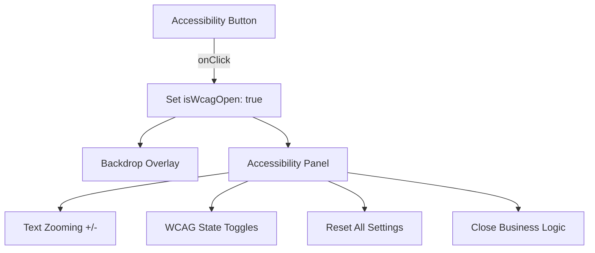

# AccessibilityPanel Component

The `AccessibilityPanel` is a critical UI component that implements Web Content Accessibility Guidelines (WCAG) and provides users with tools to customize their visual and auditory experience.

## Architectural Overview
The component consists of two main parts:
1. **Floating Trigger Button**: A fixed-position vertical ribbon button on the right edge of the viewport.
2. **Slide-over Panel**: A right-aligned sidebar that contains the specific accessibility toggles.



## State Management
The component is heavily integrated with the global Zustand store (`src/lib/store.ts`).

| State Key | Type | Description |
|-----------|------|-------------|
| `isWcagOpen` | boolean | Controls the visibility of the sidebar and backdrop. |
| `textSize` | number | Application-wide font size percentage (90% to 130%). |
| `wcagStates` | object | Map of specific accessibility flags (High Contrast, Reading Guide, etc.). |

## WCAG Features Detail

### 1. Visual Enhancements
- **High Contrast**: Toggles a pure black/white theme with high-intensity borders.
- **Invert Colors**: Flips the color palette via CSS `invert`.
- **Grey Hues**: Desaturates the entire UI via CSS `grayscale`.
- **Underline Links**: Dynamically injects `.a11y-underline` class to the body.

### 2. Interaction Aids
- **Reading Guide**: Adds a horizontal tracking line centered on the viewport via CSS `::after`.
- **Big Cursor**: Swaps the default cursor with a high-visibility SVG assets.
- **Text Spacing**: Increases letter-spacing across all text nodes.

### 3. Assistive Technology
- **Text to Speech (TTS)**: Enabling this flag prepares the UI for screen reader synthesis.
- **Speech to Text (STT)**: Enabling this flag prepares the UI for voice command inputs.

## Styling Implementation
The component uses Tailwind's `transition-transform` for smooth entry/exit. High contrast logic is handled by ternary operators on background and border classes:

```tsx
className={`... ${isHighContrast ? 'bg-black border-white' : 'bg-white border-zinc-100'}`}
```

## Accessibility Root
All changes made here are reflected at the root level in `src/app/page.tsx` via CSS classes and inline styles applied to the main container.
