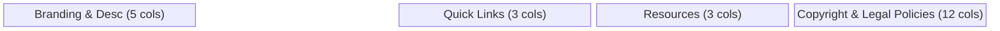

# Footer Component

The `Footer` provides a consistent navigational anchor for the application, containing organizational branding, contact details, and legally required resources.

## Architectural Role
The Footer is persistent across `portal`, `schedule`, and `search` views. It acts as a final call-to-action area for contact and information discovery.

## Key Features

### 1. Branding Alignment
Mirroring the Navbar, the Footer displays the "Mahkamah Perusahaan Malaysia" branding.
- **Interaction**: The footer logo is a functional button that resets the application view to `portal`.
- **Styling**: On standard themes, the logo is passed through a `brightness-0 invert` filter to appear white against the dark zinc background.

### 2. Information Grid
- **Contact Column**: Uses a vertical stack with Lucide icons (`MapPin`, `Phone`, `Mail`). Mobile-optimized with line-breaks for the physical address.
- **Link Columns**: Mapped from the `i18n` store to ensure bilingual support. Hover effects include a `ChevronRight` reveal and horizontal translation.

### 3. Legal & Security
- The bottom bar contains links to Privacy, Security, and Disclaimer.
- These links are visually differentiated with unique icons and subtle opacity fades.

## High Contrast Implementation
Unlike the primary portal background (zinc-950), the High Contrast footer switches to a pure `bg-black` with a `border-t-2 border-white` top border to clearly demarcate the section boundary.

| Property | Standard | High Contrast |
|----------|----------|---------------|
| Background | `bg-zinc-950` | `bg-black` |
| Text (Sub) | `text-zinc-400` | `text-white` |
| Borders | `border-zinc-800` | `border-white` |
| Icons | `text-zinc-600` | `text-white` |

## Technical Implementation
The component relies on `useAppStore` to receive the `lang` context, ensuring that all 15+ links and labels are correctly localized.
