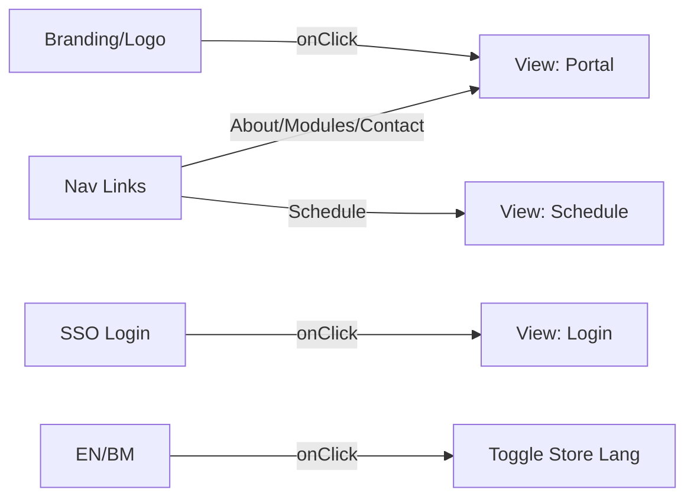

# Navbar Component

The `Navbar` serves as the primary navigation and branding header for the application, supporting multi-view portal logic and bilingual localization.

## Component Structure
The Navbar is split into two distinct tiers:
1. **Government Top Bar**: Displays the National Portal label and the Language Switcher.
2. **Primary Navigation Bar**: Contains branding, primary nav links, and the SSO Login entry.



## State Integration
| Hook/Store | Usage |
|------------|-------|
| `useAppStore` | Retrieves `lang`, `setLang`, `wcagStates`, and `setCurrentView`. |
| `useState` | Manages local `mobileMenuOpen` toggle for responsive views. |

## Feature Specifications

### 1. Branding & Navigation
- **Logo Logic**: Clicking the "Jata Negara" logo triggers `setCurrentView('portal')`, which unmounts any active specialized views (Schedule/Search) and returns the user to the hero landing.
- **View Switching**: The "Schedule" link is intercepted to trigger the dedicated `FullSchedule` view rather than a standard anchor link.

### 2. Localization
- The component uses the `t[lang]` helper from `src/lib/i18n.ts` to map string keys to the currently selected language.
- Switching language updates the entire application context immediately.

### 3. Responsive Design
- **Desktop**: Full horizontal menu with a specialized "SSO Login" button.
- **Mobile**: Collapses into a Hamburger Menu (`Menu` / `X` icons from Lucide).
- **Glassmorphism**: On non-High Contrast modes, the navbar uses `bg-white/80` with `backdrop-blur-xl`.

## Technical Highlight: High Contrast
The Navbar responds to global high contrast states by switching from a blurred translucent background to a solid black background with white borders, ensuring WCAG compliance.

```tsx
const isHighContrast = wcagStates.highContrast;
// Navigation background logic
className={`... ${isHighContrast ? 'bg-black border-b border-white' : 'bg-white/80 backdrop-blur-xl'}`}
```
