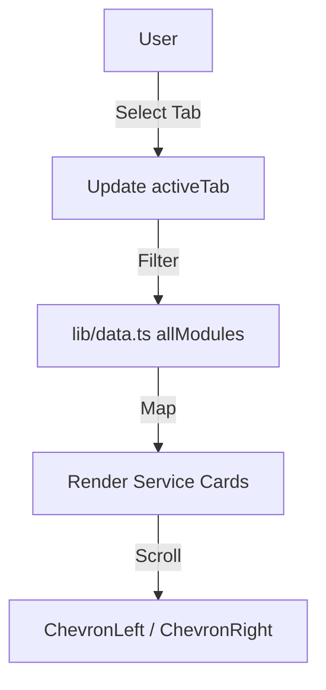

# EServicesDirectory Section

The `EServicesDirectory` is a comprehensive catalog of judicial digital services, organized into categories for efficient browsing.

## Information Hierarchy
The section follows a **Category -> Service** pattern.
1. **Tabs**: Filter the top-level categories (e.g., Public Access, Lawyer Access).
2. **Carousel**: Displays the relevant services for the selected category.

## Feature Details

### 1. Tab System
The tabs switch the `activeTab` local state, which is used as an index to access the `allModules` array. On mobile, the tabs become horizontally scrollable to prevent overflow.

### 2. Full-Bleed Carousel
Unlike standard containers, the carousel track allows cards to scroll edge-to-edge of the viewport while maintaining a consistent `max-w-7xl` alignment for the first card.
- **Navigation**: Desktop users see floating `Chevron` buttons that only appear on hover.
- **Card Logic**: Some cards are interactive call-to-actions. For example:
    - "Case Management" -> Triggers `login` view.
    - "Search Full Awards" -> Triggers `schedule` view.

## Interaction Styling
Service cards implement a "lifting" effect on hover:
- `hover:shadow-[0_20px_50px_rgba(0,0,0,0.08)]`
- `hover:-translate-y-1`
- Scaling/Rotation on the icon container for a "playful" micro-interaction.

## High Contrast Implementation
In High Contrast mode:
- Background gradients on icons are removed in favor of `border-2 border-white`.
- The "Explore" button changes from a subtle grey circle to a high-contrast white fill on hover.
- Cards receive a `border-2 border-white` for clear separation.
