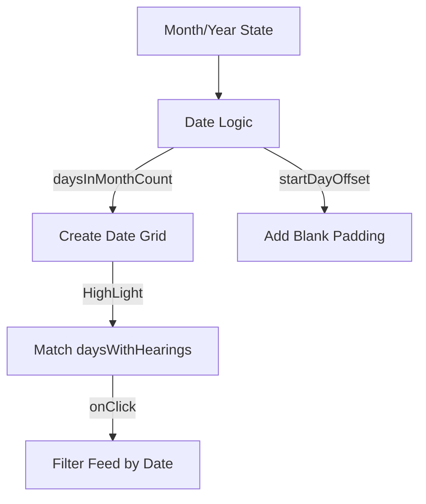

# FullSchedule Section

The `FullSchedule` component is the most technically complex section of the portal, providing a dedicated, filterable interface for viewing the entire court proceeding database across Malaysia.

## Key Sub-Systems

### 1. The Smart Calendar Component
The calendar is a custom implementation that dynamically calculates the date grid for any month/year combination.

#### Selection Logic
- **Desktop**: Renders as a standard 7-column grid with a monthly dropdown.
- **Mobile**: Transforms into a smooth horizontal scrollable ribbon (`snap-center`) for thumb-friendly date selection.

### 2. Geographic Filtering Engine
A cascading filter system where selecting a **Region** (e.g., Selangor) automatically updates the available **Courts** (e.g., Mahkamah 1, 2, 3) in the secondary dropdown.
- **Data Source**: `courtLocations` array in `src/lib/data.ts`.

### 3. Isolated Search Integration
Unlike the global portal search, this section contains a local searching mechanism that filters the displayed schedule results without redirecting the user.
- **Persistence**: Using `scheduleSearchQuery` ensures that a user can search within the schedule, go back to the home page, and come back to find their schedule query still intact.
- **Semantic Logic**: If a user types a query, the system ignores the specific date/court filters and performs a global search across all mock data for matching case names or IDs.

## Data Schema & Mapping
The feed uses the same expandable card components as the `HearingsSchedule` portal dashboard, ensuring UI consistency while allowing for more granular filtering.

## Technical Details

| Property | Implementation |
|----------|----------------|
| **Month Logic** | `new Date(year, month + 1, 0).getDate()` |
| **Start Offset** | `new Date(year, month, 1).getDay()` |
| **Search State** | `useAppStore.scheduleSearchQuery` |
| **Scroll Snap** | `snap-x snap-mandatory` (Mobile) |

## High Contrast Adapters
The calendar and filters are heavily adapted for High Contrast:
- **Selected States**: Uses a solid white background with black text.
- **Indicators**: Hearing indicator dots switch to pure black (on white) or white (on black).
- **Hierarchy**: All subtle grey backgrounds are replaced with solid black.
