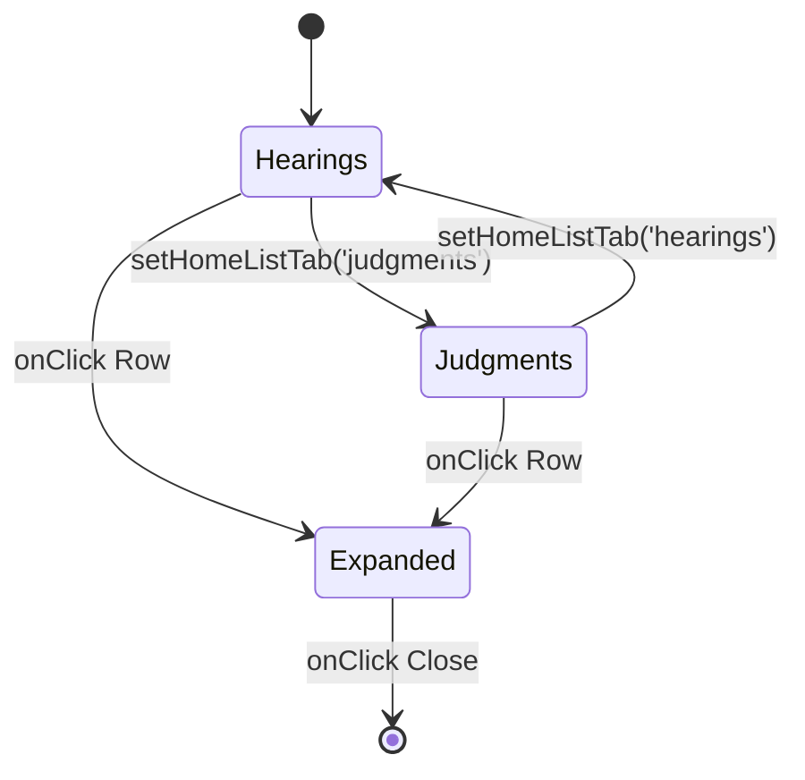

# HearingsSchedule Section

The `HearingsSchedule` component acts as the primary data dashboard for the portal landing, providing real-time feeds of upcoming proceedings and latest awards.

## Dual Feed Logic
The section manages two distinct data streams within a single UI framework:
- **Upcoming Hearings**: Real-time proceedings scheduled for the current period.
- **Latest Judgments**: Recently published archival awards.



## Interaction Design: The Accordion
To keep the dashboard clean, detailed case info is hidden behind an accordion.
- **State**: The `expandedId` tracks which case (by ID) is currently open. Only one can be open at a time.
- **Content**: When expanded, the UI reveals:
    - Case Summary & Disputes.
    - Associated Keywords (Interactive tags).
    - Functional Actions (View Details, Download PDF).

## Key Components

### 1. The Notices Sidebar
A dedicated right-column (on desktop) that provides a chronological list of court practice directions. 
- **Layout**: Sticky-style (h-fit) to remain visible while the user scrolls multiple rows of hearings.
- **Visuals**: Uses a distinct dark theme (`bg-zinc-900`) in non-High Contrast mode to contrast with the main list's white background.

### 2. View Switching
A "View All" button is prominently placed to switch the global view to `schedule`, allowing users to access the full-screen filterable database.

## Technical Implementation: Bilingual Tags
The hearing types are dynamically mapped based on the `lang` state to ensure terminology accuracy (e.g., "Mention" vs "Sebutan").

```tsx
const mockHearingsTypes = lang === 'en' ? 
    ['Trial', 'Mention', ...] : 
    ['Bicara', 'Sebutan', ...];
```

## Accessibility Features
Each expandable row is a functional button, and the `expanded` state is signaled visually with a rotating Chevron and high-contrast ring/shadow border (`ring-4 ring-blue-500/10`).
