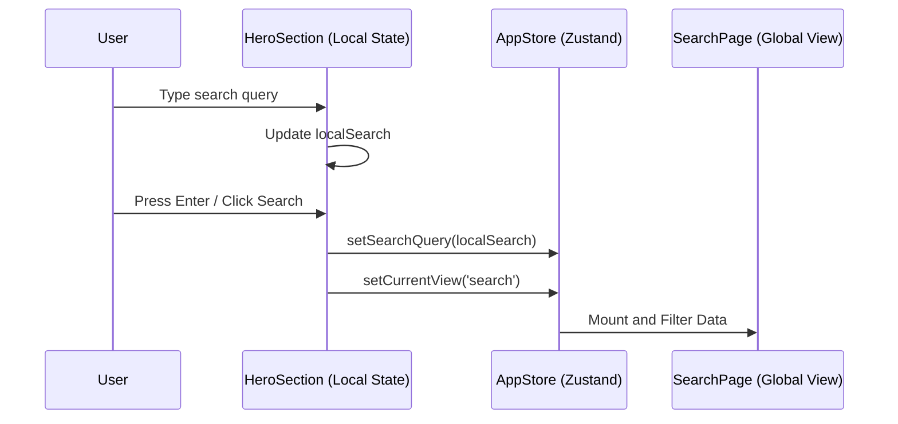

# HeroSection Section

The `HeroSection` is the high-impact visual landing of the portal, designed to guide the user into the primary search functionality immediately.

## Design Rationale
- **Visuals**: Uses a deep zinc background with blue/indigo radial gradients (blur-120px) to create a premium, high-tech government portal feel.
- **Typography**: Employs a text-gradient on the final word of the title in standard mode to add a modern accent.
- **Micro-animations**: Includes a pulsing indicator for the "Version 2.0 Live" badge.

## Interaction Flow: Global Search
The search input in this section is the primary entry point for the `SearchPage`.



## State Management
| Variable | Scope | Description |
|----------|-------|-------------|
| `localSearch` | Local | Controls the input value before submission. |
| `searchQuery` | Global | The source of truth for all portal-wide searches. |
| `setCurrentView` | Global | Toggles from `portal` (landing) to `search` (results). |

## High Contrast Behavior
In High Contrast mode, all background gradients and blur effects are disabled. The search input receives a solid white border and a black background, while the "Search" button switches to a high-visibility solid white fill with black text.

```tsx
// Conditional rendering for ambient background
{!isHighContrast && (
    <div className="absolute inset-0 pointer-events-none">
        <div className="absolute top-[-20%] ... blur-[120px]"></div>
    </div>
)}
```
