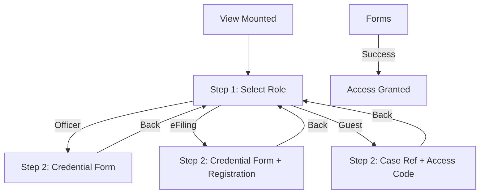

# LoginSection Section

The `LoginSection` provides a secure, unified gateway for all user personas interacting with the Industrial Court Portal. It utilizes a two-step state machine to simplify the authentication process.

## Architectural Flow
The component transitions between two distinct states: **Persona Selection** and **Authentication Form**.

## State Management
| Store Key | Type | Description |
|-----------|------|-------------|
| `loginRole` | string \| null | Tracks the currently selected persona (`officer`, `efiling`, `guest`). |
| `setCurrentView` | function | Used to exit the login gateway and return to `portal`. |

## Feature Specifications

### 1. Step 1: Role Selection
Users choose their persona based on clear visual cards.
- **Officer**: Formal access for court staff.
- **eFiling User**: Standard access for legal professionals.
- **Guest Access**: Specialized lightweight access for virtual hearing attendance.

### 2. Step 2: Dynamic Form Injection
Based on the `loginRole`, the UI conditionally renders specific input fields:
- **Common**: `userId` / `password`.
- **Guest Only**: `caseRef` (Case reference number) and `accessCode` (6-digit hearing PIN).
- **eFiling Only**: Includes "Forgot Password", "Register", and "MyDigital ID" integration triggers.

## Security & Visualization
- **Ambient UI**: Uses radial gradients (`blue-600/10`) to provide a focused, secure aesthetic.
- **Transitions**: Employs Tailwind's `animate-in fade-in zoom-in-95` to ensure smooth step transitions.
- **High Contrast**: All focused ambient effects are removed. Input fields receive a thicker `border-2 border-white` for clarity.

## Technical Implementation
The login gateway is a full-screen override. When `currentView === 'login'`, the standard Navbar and Footer are unmounted at the root level (`page.tsx`) to provide a distraction-free authentication experience.
