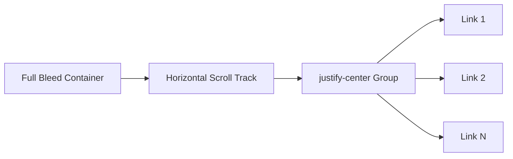

# QuickLinksSection Section

The `QuickLinksSection` provides immediate access to high-frequency actions via a modern, horizontal carousel navigation.

## Functional Strategy
Rather than standard links, most quick links are "action triggers" that change the application's global state to route users to the correct functional module.

### Interaction Mapping
| Index | Action Name | Resulting View | Logic |
|-------|-------------|----------------|-------|
| 0 | File a Document | `login` | Directs to Unified Login |
| 1 | Join Virtual Court | `login` | Directs to Unified Login |
| 2/3 | Check Schedule / Search | `schedule` | Switches to Full Schedule |
| 4/5 | Practice Notes | `portal` | Anchors to relevant list |

## UI & Layout Architecture
The section is built to handle flexible content counts while maintaining visual balance.



### Key Styling Patterns
- **Centering Logic**: The track uses `justify-center` to ensure that if only 3-4 links are present, they are centered on the screen rather than pinned to the left.
- **Snap Scrolling**: Implements `snap-x snap-mandatory` so that flicking on mobile always lands a card in the center of the viewport.
- **Glassmorphism**: Each card uses a delicate white background with a specific blue shadow (`rgba(59, 130, 246, 0.15)`) to pop against the light grey background.

## Technical Implementation
Icons are mapped using an `iconColors` array from `src/lib/data.ts`. This allows the UI to cycle through icons and ensure each quick link has a distinct visual identity without hardcoding icons inside the section component.

```tsx
const Icon = iconColors[idx % iconColors.length];
```
